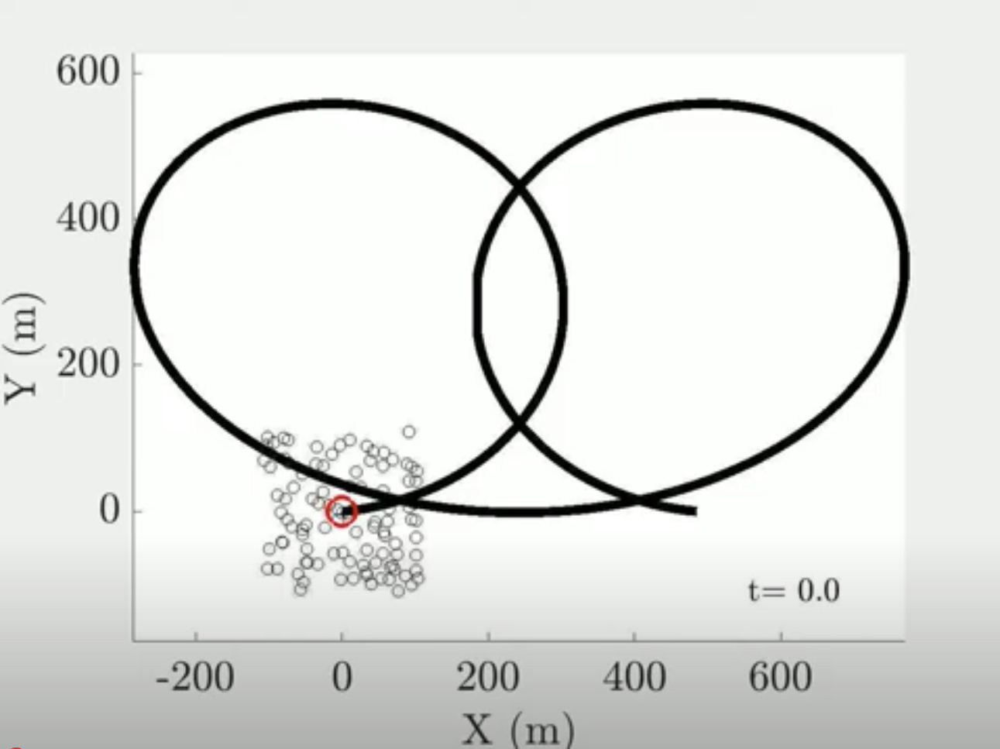
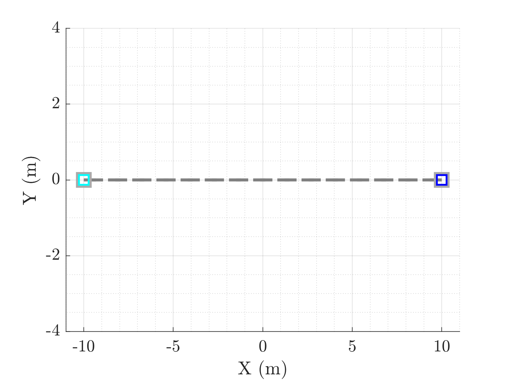
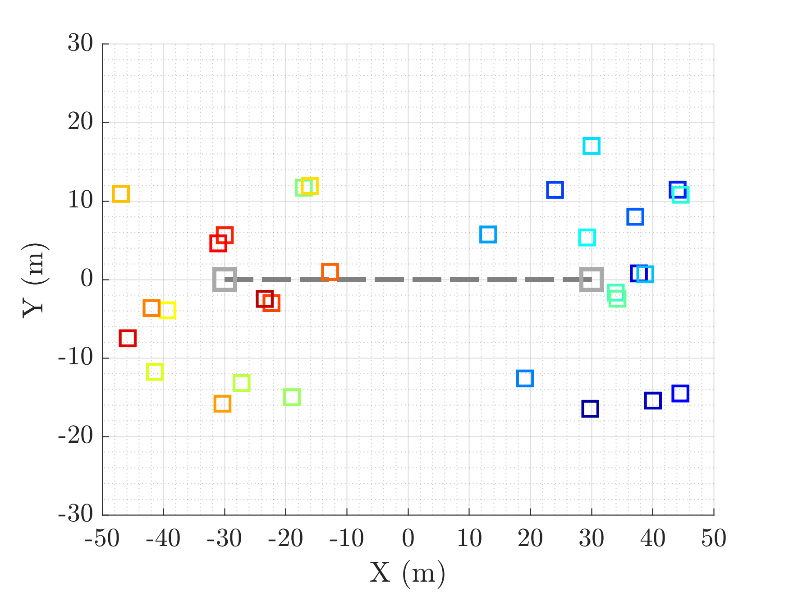

# Research Overview 

As we enter an era of autonomy and artificial intelligence (AI), humans are being liberated from conducting tedious, complex, or even hazardous missions by robots. The planning and control algorithms are the nuclei of such an autonomous and intelligent robot to perform tasks. In real world applications, such as autonomous transportation/delivery, smart manufacturing/construction, and aerospace/marine engineering, the robot is subjected to uncertain external disturbances, parametric variations, actuator saturation/delay, and modeling/estimation/measurement errors. Furthermore, teams of robots are needed to perform collaboratively while ensuring inter-robot and robot-obstacle collision avoidance. This requires safety, robustness, resilience, scalability, sustainability, and computational efficiency to be indispensable features of the planning and control algorithms, which attracts ongoing research efforts within the robotics and control community.  

To address these needs, I have developed a new control paradigm that is _defined entirely by the active subset of a full set of inequality constraints at any instant_ for general (i.e., nonlinear, time-varying, arbitrary-order) dynamical systems. Distinct from the literature, my work poses the control problem as a constrained optimization that does **_not_** involve a cost function, a time horizon, or any linearization, and the stability, performance (e.g., path tracking and collision avoidance), and structure (i.e., centralized or decentralized) of the controller are realized by constraints alone. I have successfuly applied this paradigm to controlling swarms of navigation systems such as quadrotor UAVs and wheeled mobile robots and published the results in several highly-ranked journals and conferences in automation and control. 

<!---
I propose a new control paradigm for general dynamical systems such as robots in my dissertation by rejuvenating a fundamental principle conceived by the polymath Gauss in 1829. The methodology poses the control problem at hand as a constrained minimization problem whose objective function, the unconstrained dynamics, is always satisfied. The performance of e.g., virtual leader tracking and collision avoidance and the controller structure (i.e., centralized or decentralized) are achieved by constraints alone. This approach has been applied to the navigation control of hundreds of double integrators, nonlinear quadrotor drones, and two-wheeled mobile robots. I feel humbled and excited that my method is recognized by highly-ranked journals and conferences in automation and control. 
--> 

# Active Projects:

## Multi-agent Double Integrators Swarm Navigation 



[//]: # (
)

[//]: # (  )

[//]: # (
)

<iframe width="640" height="360" src="https://www.youtube.com/embed/HkIxFIba1sI" title="100-agent swarm navigation and control;" frameborder="0" allow="accelerometer; autoplay; clipboard-write; encrypted-media; gyroscope; picture-in-picture; web-share" allowfullscreen></iframe>

  
<b>[Abstract]</b>

Multiagent navigation systems present opportunities for many applications due to their agility and cooperation. In any multiagent navigation system, it is critical that actual interagent collisions are strictly prevented. In this article, we present a solution to the 2-D multiagent navigation problem with collision avoidance. Our solution to this problem is based on a novel extension to Gauss's principle of least constraint (GPLC), in which a fixed set of strict equality constraints is replaced by time-varying sets of active inequality constraints. To the best of our knowledge, this is the first instance that extends GPLC with dynamic incorporation and stabilization of active inequality constraints and with actuator delay and saturation. Herein, the dynamics of a collision-free multiagent system satisfies the Karush-Kuhn-Tucker conditions. Active inequality constraints enforce collision avoidance, leader following, and agglomeration behaviors, and they are stabilized using Baumgarte's error stabilization approach. We show that in dense configurations, the positional arrangement of the agents can lead to linearly dependent constraints, and we propose specialized solutions involving QR decomposition and regularization. The efficacy and efficiency of the proposed method are demonstrated by a dimensional analysis of a worst-case scenario and numerical studies of up to 100 agents tracking a prescribed virtual leader.

- Access our paper via [[paper](https://ieeexplore.ieee.org/document/9354990)].
- Watch the demo via: [[YouTube](https://youtu.be/HkIxFIba1sI)].

## Natual Deadlock Resolution for Multi-agent Multi-swarm Navigation



[//]: # (
)

[//]: # (  )

[//]: # (
)

<iframe width="640" height="360" src="https://www.youtube.com/embed/ogNqEoryYIQ" title="Two-Agent Deadlock Resolution;" frameborder="0" allow="accelerometer; autoplay; clipboard-write; encrypted-media; gyroscope; picture-in-picture; web-share" allowfullscreen></iframe>

[//]: # (
)

[//]: # (  )

[//]: # (
)

<iframe width="640" height="360" src="https://www.youtube.com/embed/10CXrmDop48" title="Two 15-Agent Swarms Deadlock Resolution;" frameborder="0" allow="accelerometer; autoplay; clipboard-write; encrypted-media; gyroscope; picture-in-picture; web-share" allowfullscreen></iframe>

  
<b>[Abstract]</b>

This paper presents a nonlinear and discontinuous control scheme for two-dimensional (2-D) multi-agent multi-swarm navigation that resolves deadlocks, without heuristics, by agents reacting purely to their constrained dynamics. The method is based on extensions of Gauss's Principle of Least Constraint that dynamically identify, incorporate, and stabilize time-varying sets of constraints and that integrate actuator saturation and delay. The deadlocks are naturally resolved by formulating the 2-D leader following and collision avoidance requirements as decomposed inequality constraints along the X and Y axes and by asymmetrically assigning zero collision avoidance constraint value to a specific branch. Numerical results are presented for two agents and two 15-agent swarms resolving nominal deadlocks at a computation time order of 10 microseconds, demonstrating the efficacy and efficiency of the proposed approach.

- Access our paper via [[paper](https://ieeexplore.ieee.org/document/9683102)].
- Watch the demos via: [[YouTube-1](https://youtu.be/ogNqEoryYIQ)] and [[YouTube-2](https://youtu.be/10CXrmDop48)].

## Unified Position and Attitude Control of A Fully Nonlinear Quadrotor

This paper presents a departure from hierarchical cascade methods to control the position and attitude of a fully nonlinear quadrotor. The paper presents a nonlinear feedback control scheme that simultaneously controls position and attitude. The proposed method is based on a generalization of the Gauss's Principle of Least Constraint (GPLC) for higherorder constrained dynamical systems. By double differentiating the rigid-body position dynamics of a fully nonlinear quadrotor with respect to time, the translational and rotational dynamics become fully coupled at the levels of snap and angular acceleration, and the quadrotor is turned into a fully actuated system in a reduced configuration space. A generalized Baumgarte's error stabilization (BES) is developed to asymptotically drive constraint errors to zero. The nonlinear control law is due purely to the natural evolution of constrained system dynamics. To the best of our knowledge, this is the first instance that GPLC and BES are both extended to higher-order systems and that the control scheme for the position and attitude of a quadrotor is unified into one step by making use of its fully nonlinear constrained dynamics. The efficiency and efficacy of the proposed method is demonstrated by numerical experiments on a quadrotor tracking a prescribed conical spiral.

## Centralized, Unified Position-Attitude Control of Multiple Nonlinear Quadrotors

In this paper, we propose a novel nonlinear feedback control law to maneuver a swarm of nonlinear quadrotors with interagent collision avoidance. In contrast to the predominant hierarchical control architectures and dynamics linearization in controller synthesis in the literature, we control the position and attitude of each drone simultaneously in one unified step, with no dynamics linearization involved at any stage. Our method is based on generalizations of Gauss’s principle of least constraint that allows higher order constrained dynamics and that identifies, stabilizes, and incorporates the time-varying sets of active constraints. The active constraints are asymptotically stabilized to the controlled space according to a generalized constraint stabilization to provide command control actions. Numerical results are provided for a swarm of up to 80 nonlinear quadrotors executing aggressive flights and for eight nonlinear drones swapping positions on a circle, attesting to the efficacy and efficiency of the proposed scheme.
